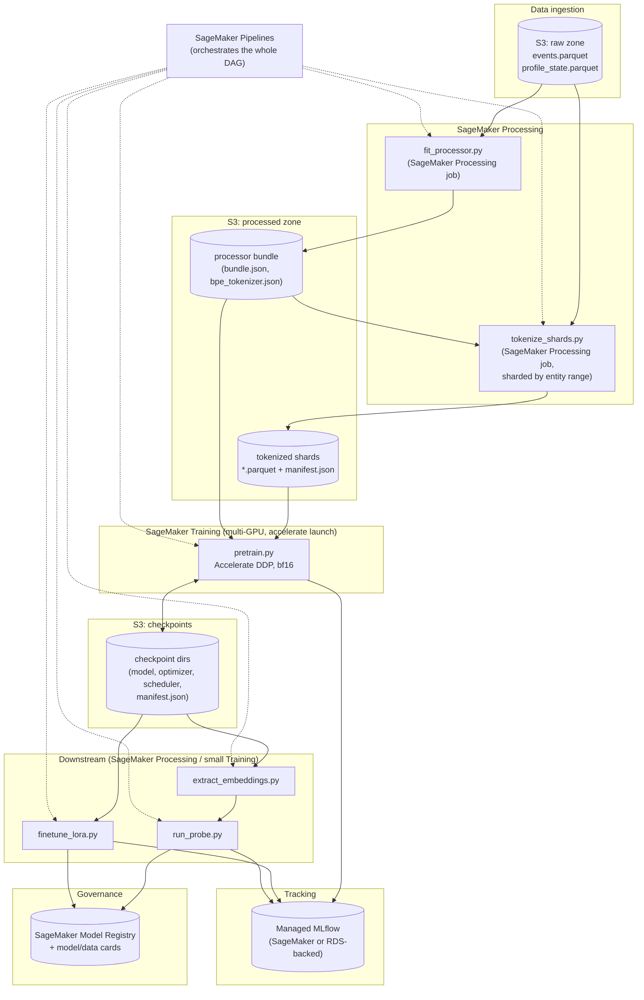

# AWS Migration Plan

Guidance for porting PRAGMA from this local, single-CPU-box dev environment
to AWS so it can run a large-scale pilot (per `CLAUDE.md`: "one day this
project will be ported to AWS so I can run it at scale"). This is a planning
document, not an implementation — no code changes have been made from
writing it. Treat it the way `docs/adr/` treats an unresolved design
question: read it before doing the actual migration work, and turn its
open decisions into real ADRs once they're made for real (see
[§8](#8-open-decisions-that-need-an-adr-before-migrating)).

**Scope:** this plan targets the phase this project is actually at —
Phase 12 (`plans/progress.md`), i.e. "decide on scale-up" — not a rebuild.
The three-layer architecture (`CLAUDE.md`) already exists specifically to
make this migration a wiring change: `src/pragma/` never touches the
filesystem or a specific device directly, `scripts/` are thin CLI entry
points, and `Accelerate` already abstracts single-device vs. multi-GPU DDP
(ADR 0011). The job here is mostly infrastructure around an
already-portable core, not a rewrite of the core itself.

---

## 1. What already doesn't need to change

Worth stating explicitly, because it bounds the size of this migration:

- **`PretrainingEngine`/`DownstreamTrainer`** (`src/pragma/training/engine.py`,
  `src/pragma/downstream/trainer.py`) never call `torch.cuda` directly and
  never hardcode device/DDP logic — everything goes through `Accelerator`
  (ADR 0011). Launching the exact same `scripts/pretrain.py` via
  `accelerate launch --multi_gpu --num_processes=N` on a multi-GPU instance
  requires no code change, only an `accelerate config`/launch command change.
- **`PragmaRecordStore`** (`src/pragma/data/storage.py`) is already an
  interface with one concrete `ParquetShardStore` implementation. Section
  10.1 of the plan anticipated a "distributed object-store backend" behind
  the same interface — that's exactly the seam S3 slots into (see §3).
- **`CheckpointManager`** (`src/pragma/artifacts/checkpoint.py`) already
  writes one self-contained, atomic directory per checkpoint (weights,
  optimizer/scheduler, RNG state, manifest with processor hash, code
  revision, dependency-lock fingerprint) per ADR 0007. That directory is
  exactly the unit that should get synced to S3 — no format change needed,
  only a "where does this directory live" change.
- **Scripts are already thin CLI entry points** (`CLAUDE.md`'s three-layer
  rule) that take `--*-dir` path arguments with local defaults. Every one
  of `scripts/{generate_synthetic_data,fit_processor,tokenize_shards,
  pretrain,extract_embeddings,run_probe,finetune_lora}.py` already accepts
  the directories it reads/writes as arguments — this is precisely what
  makes them portable to SageMaker Processing/Training job entry points, as
  the plan's Executive Summary (`plans/PRAGMA-Implementation-Plan.md`
  §12) anticipated.
- **MLflow** is already used for experiment tracking (ADR 0011) — only its
  backend store needs to move (SQLite file → RDS/managed tracking server),
  not the logging calls themselves (`mlflow.log_metrics`, `mlflow.start_run`
  in `engine.py`, `trainer.py`, `pretrain.py`).

## 2. Recommended AWS architecture

### 2.1 Service map by pipeline stage

| Plan pipeline stage (§4 of the implementation plan) | Local today | AWS service | Why |
|---|---|---|---|
| Raw event/profile tables | `data/raw/*.parquet` | **S3** (raw zone) + optionally **Glue Catalog** for schema discovery | Durable, versioned, cheap object storage; Athena/Glue give SQL-queryable raw data without standing up a database |
| Point-in-time record building + processor fitting | `scripts/fit_processor.py` (local CPU) | **SageMaker Processing job** (CPU instance, e.g. `ml.m5.4xlarge`) | Same script, no code change — a Processing job is just "run this container against S3 input/output channels" |
| Tokenized shard writing | `scripts/tokenize_shards.py` | **SageMaker Processing job** (can be the same job as fitting, or parallelized as a **Processing job with sharded input** / **AWS Batch array job** if the raw corpus is large enough to shard by entity range) | Same reasoning; sharding across raw partitions parallelizes trivially since `PointInTimeRecordBuilder` is per-entity |
| Tokenized shard storage | `data/shards/*.parquet` + `manifest.json` | **S3** (processed zone), read via **S3 Mountpoint** or `s3fs`/streaming Parquet reads in `TokenizedRecordDataset` | Matches §10.1's own storage interface intent; PyArrow reads Parquet directly from `s3://` with `pyarrow.fs.S3FileSystem` with no code change to `ParquetShardStore` beyond swapping `Path` for an S3-aware path — see §3.1 |
| Pretraining (multi-GPU, Accelerate DDP) | `scripts/pretrain.py` (single CPU process) | **SageMaker Training job** with a multi-GPU instance (e.g. `ml.g5.12xlarge` = 4x A10G, or `ml.p4d.24xlarge` = 8x A100 for a larger pilot) launched via `accelerate launch`, or the same job type via **AWS Batch (multi-node, EFA-enabled)** if you outgrow one instance | `Accelerator` already does the right thing on N GPUs with zero `pragma.training` code changes (ADR 0011) — SageMaker Training just needs to invoke `accelerate launch scripts/pretrain.py` instead of `python scripts/pretrain.py` inside the container entry point |
| Checkpoints | `data/checkpoints/pretrain/*` (local disk) | **S3** (checkpoints bucket/prefix), with **SageMaker Training's built-in checkpoint sync** (`/opt/ml/checkpoints` -> S3) if using Training jobs, or explicit `aws s3 sync` if using Batch/EC2 | Training jobs on spot/managed-spot instances can be interrupted; S3-synced checkpoints let a resumed job pick up via `CheckpointManager.load()` unchanged |
| Experiment tracking | `data/mlflow/mlflow.db` (local SQLite) | **Managed MLflow on SageMaker** (SageMaker's native MLflow tracking server) or self-hosted MLflow on **ECS/Fargate + RDS (Postgres) + S3 artifact store** | SQLite doesn't work with concurrent writers across distributed jobs/multiple runs; either option keeps `mlflow.log_metrics(...)` calls in `engine.py`/`trainer.py` unchanged — only `mlflow_tracking_uri` changes |
| Embedding extraction, probes, baselines, LoRA fine-tuning | `scripts/extract_embeddings.py`, `run_probe.py`, `finetune_lora.py` (local CPU) | **SageMaker Processing jobs** (extraction/probes are CPU-bound after the frozen forward pass) or a small **SageMaker Training job** for LoRA (still benefits from 1 GPU) | Same "thin CLI, swap paths" pattern as fitting/tokenizing |
| Orchestration across all of the above | Manual, one script at a time (`CLI_GUIDE.md`) | **SageMaker Pipelines** (or **Step Functions** if you want something less SageMaker-specific) | Encodes `CLI_GUIDE.md`'s existing 7-step order-of-operations as a DAG with retries, caching, and lineage instead of a runbook a human follows by hand |
| Model registry / promotion | Ad hoc (`data/checkpoints/*`, manually inspected) | **SageMaker Model Registry** entries pointing at S3 checkpoint prefixes, gated by the promotion criteria already listed in plan §19 | Turns "every promoted checkpoint needs a model card, data card, parity results, probe report" (already a plan requirement) into an actual approval gate instead of a convention |

### 2.2 Why SageMaker over raw EC2/Batch

The implementation plan itself (§1: "Target: ... that can be scaled ... without replacing its core") and `CLAUDE.md`'s three-layer architecture ("This project targets an eventual AWS deployment (likely SageMaker Processing/Training jobs, or Batch)") already anticipate this. Recommendation: **SageMaker Processing + Training + Pipelines as the default**, with **AWS Batch as the fallback only if/when a training run needs multi-node** (SageMaker Training does support multi-node too, via `instance_count > 1` + Accelerate's multi-node launch config, but Batch's array-job model is more natural if the *data-generation/tokenization* stage — not training — is what needs to fan out across hundreds of workers for a much larger corpus than the current synthetic 500-entity pilot). Given PRAGMA-S is ~10M params and the plan explicitly defers FSDP/DeepSpeed until scale genuinely requires them (§3 "Executive technical decisions"), single-node multi-GPU DDP via SageMaker Training covers the 4-month pilot scope comfortably — don't reach for Batch multi-node prematurely.

### 2.3 Architecture diagram

---

## 3. Code changes needed

Genuinely small, because of the architecture decisions already in place. None of these are attempted here — this section is the list to work from when the migration actually starts.

### 3.1 Storage layer: add an S3-backed `PragmaRecordStore` / path handling

- `src/pragma/data/storage.py`'s `PragmaRecordStore` is already an ABC with
  one method pair (`write_shard`/`read_shard`) taking a `Path`. The
  cleanest change is **not** a new `S3ShardStore` subclass with its own
  boto3 calls — it's making `ParquetShardStore` accept any
  `pyarrow.fs.FileSystem`-compatible path, since `pyarrow.parquet.write_table`/
  `read_table` already support `s3://` URIs transparently via
  `pyarrow.fs.S3FileSystem` (or fsspec's `s3fs`). Concretely: change
  `write_shard`/`read_shard` signatures from `Path` to `str | Path` and let
  PyArrow's own filesystem resolution handle `s3://bucket/prefix/...` vs.
  a local path — no new class needed, no interface change.
- `write_dataset`/`read_dataset`/`DataManifest.save`/`DataManifest.load`
  (same file) currently do `out_dir.mkdir(...)`, `(out_dir / MANIFEST_FILE)
  .write_text(...)`, `.read_bytes()` for checksums — these are plain
  `pathlib.Path` calls that don't work against `s3://` URIs. Two options:
  (a) keep manifest/checksum I/O local (SageMaker jobs already get an S3
  input channel mounted as a local path at `/opt/ml/processing/input/...`,
  so `Path` semantics keep working without any code change if you use
  SageMaker's channel mechanism rather than raw `s3://` URIs in the
  scripts), or (b) genuinely abstract these few calls behind a tiny
  local-or-S3 helper. **Recommendation: (a) for the pilot** — SageMaker
  Processing/Training jobs already copy S3 input channels to a local mount
  and sync local output directories back to S3 automatically, so
  `scripts/*.py`'s existing `--*-dir` arguments need **zero changes**,
  only the job definition's channel config changes. This is the path of
  least code change for a 4-month pilot; only move to native `s3://` reads
  in `ParquetShardStore` if streaming (not staging) very large shard sets
  becomes a real bottleneck (§6).
- `pragma.artifacts.checkpoint.CheckpointManager` and
  `pragma.processing.processor.PragmaProcessor.save`/`.load` have the same
  property (plain `Path` I/O) and the same recommendation applies: run them
  against SageMaker's local channel mounts first, don't rewrite them for S3
  paths unless streaming becomes necessary.

### 3.2 Checkpoint sync and resume semantics

- No change to `CheckpointManager` itself under the SageMaker-channel
  approach (§3.1). What does need to be added: a small wrapper (in
  `scripts/pretrain.py`, not `src/pragma/`, since this is job-orchestration
  glue, not business logic) that, at job start, downloads the latest
  checkpoint from an S3 checkpoint prefix into the local
  `--checkpoint-dir` (if resuming), and at job end/periodically, the
  existing checkpoint directory syncs back to S3. SageMaker Training's
  **managed spot training with checkpointing** (`checkpoint_s3_uri`
  parameter on the `Estimator`) does exactly this sync automatically if the
  local checkpoint dir is set to `/opt/ml/checkpoints` — no custom sync
  code needed, just point `--checkpoint-dir /opt/ml/checkpoints` when
  launching via SageMaker.
- `CheckpointManager.load()` already fails loudly on a missing/mismatched
  processor bundle (ADR 0007) — this property should be preserved exactly;
  it's actually more valuable on AWS, where a mis-pointed S3 prefix is an
  easy mistake and "silently resume with the wrong processor" would be a
  much worse failure mode there than locally.

### 3.3 MLflow tracking URI

- `TrainingConfig.mlflow_tracking_uri` (`src/pragma/config/training_config.py`)
  is already a plain string field defaulting to a SQLite path, already
  overridable via `scripts/pretrain.py --mlflow-tracking-uri` and
  `DownstreamConfig`'s equivalent. **No code change** — only the value
  passed at launch time changes, to either:
  - SageMaker's managed MLflow tracking server ARN
    (`arn:aws:sagemaker:...:mlflow-tracking-server/...`), or
  - a self-hosted MLflow server's `https://` endpoint backed by RDS
    Postgres + an S3 artifact store.
  Recommendation: **SageMaker's native managed MLflow** if available in
  your account/region — avoids running and patching an MLflow server
  yourself, and integrates with SageMaker's IAM model directly. Fall back
  to self-hosted (ECS Fargate + RDS + S3) only if managed MLflow isn't
  available in the target region or account tier.
- One real gap: `engine.py`'s `mlflow.set_tracking_uri`/`start_run` calls
  are gated on `accelerator.is_main_process` (ADR 0011 decision 6) — this
  is correct and should NOT change, but worth explicitly re-verifying
  against a managed tracking server under real multi-GPU DDP once that's
  testable (see §5), since the current dev machine has never run this
  under N>1 processes at all.

### 3.4 Job entry points / Dockerfile

- None of `src/pragma/` needs a container-specific change. What's needed
  is new, purely additive infrastructure code that doesn't exist yet:
  - A **Dockerfile** (or use of SageMaker's pre-built PyTorch/HF DLC images
    as a base) that installs via `uv sync` — `pyproject.toml`/`uv.lock`
    already fully pin the dependency set, so this is close to
    `FROM <sagemaker-pytorch-training-image>` + `COPY . .` + `RUN uv sync
    --frozen`.
  - A SageMaker `Estimator`/`Processor` Python definition (typically kept
    in a new `infra/` or `sagemaker/` directory, not `src/pragma/` — it's
    deployment wiring, same category as `scripts/`) that maps each
    `scripts/*.py` entry point to a job type, instance type, and S3
    input/output channels. This is genuinely new code, but it's a thin
    wrapper matching the existing thin-script pattern, not new business
    logic.
  - For multi-GPU Training jobs specifically: the container's entry point
    needs to invoke `accelerate launch --multi_gpu --num_processes=<N>
    scripts/pretrain.py ...` rather than `python scripts/pretrain.py ...`
    — SageMaker Training sets `SM_NUM_GPUS`/`SM_HOSTS` environment
    variables that an entry-point shell script can read to build the right
    `accelerate launch` invocation (or use SageMaker's own
    `distribution={"torch_distributed": {"enabled": True}}` Estimator
    parameter, which sets up the process group directly). Either approach
    needs testing on **real GPU hardware for the first time** — see §5,
    this is the single highest-risk item in the whole migration.

### 3.5 CI/CD

- `.github/workflows/ci.yml` already runs lint/type/test on every push/PR.
  Additive-only changes for AWS: a deploy workflow (build+push the
  container image to **ECR** on merge to `main`, optionally trigger a
  SageMaker Pipeline execution) — doesn't touch the existing CI job at all.

### 3.6 Summary table

| File | Change | Size |
|---|---|---|
| `src/pragma/data/storage.py` | Accept `str \| Path` for S3-URI compatibility (only if going beyond SageMaker channel mounts — §3.1(b)) | Small, deferred |
| `scripts/*.py` | None, if using SageMaker channel mounts (§3.1(a)) | None |
| `pyproject.toml`/`uv.lock` | None — already pins everything a Dockerfile needs | None |
| New: `Dockerfile` | Base on SageMaker PyTorch DLC + `uv sync --frozen` | New, small |
| New: `infra/` or `sagemaker/` job definitions | `Estimator`/`Processor`/`Pipeline` Python defs per stage | New, moderate |
| New: entry-point shell wrapper for multi-GPU launch | Reads `SM_NUM_GPUS`, builds `accelerate launch` command | New, small |
| `.github/workflows/` | New deploy workflow (ECR push, pipeline trigger) | New, small |
| `TrainingConfig`/`DownstreamConfig` mlflow URI | None — already a config field | None |

---

## 4. Data volume and IAM considerations

- **Buckets** (minimum viable layout): `s3://pragma-<env>-raw/`,
  `s3://pragma-<env>-processed/` (processor bundles + tokenized shards),
  `s3://pragma-<env>-checkpoints/`, `s3://pragma-<env>-mlflow-artifacts/`
  (if self-hosting MLflow), `s3://pragma-<env>-reports/` (probe/baseline
  comparison CSVs, model cards, data cards per plan §19). Separate
  dev/staging/prod prefixes or accounts depending on how strict you want
  the pilot's governance to be — given this handles real customer
  financial event data eventually (plan §5.5's client-mapping/privacy
  language), prefer separate AWS accounts for anything touching real
  (non-synthetic) data, not just prefixes.
- **IAM**: distinct execution roles per job type (processing role needs
  raw-zone read + processed-zone write; training role needs processed-zone
  read + checkpoint read/write + MLflow write; least-privilege, not one
  shared "SageMaker can do everything" role). This matters more here than
  in most ML projects because plan §5.5 already anticipates multi-client
  data and explicitly says "client identity should not be a model feature
  by default" and "pooling data across clients is a separate legal,
  governance ... decision" — IAM boundaries are the actual enforcement
  mechanism for that governance decision once this is on shared
  infrastructure, not just a code convention.
- **Encryption**: SSE-KMS on every bucket, customer-managed keys if the
  eventual real client extract (plan §1's "small de-identified client
  extract," still outstanding per `plans/progress.md`'s open items) lands
  in any of these buckets — synthetic-data-only buckets can use SSE-S3,
  but plan for the real-data buckets to need KMS from day one so this isn't
  a retrofit later.

## 5. Distributed training and Accelerate on AWS — the actual risk

This is the part of the migration that's genuinely unverified, not just
unported. Repeated through `plans/progress.md` (Phase 7's "GPU-side
re-verification needed," Phase 8's "multi-GPU comparability... structurally
true... needs re-verification the first time real multi-GPU hardware is
available," Phase 11's DDP note inheriting the same status): **every
multi-GPU/DDP claim in this codebase is structural, not empirically
tested**, because the dev machine's GPU (GTX 1650 Ti, 4GB, CUDA-11-only
driver) has never run a real multi-GPU job. AWS is where that gets proven
for the first time, and it should be treated as its own validation step,
not folded silently into "the pilot run":

1. **First real-hardware milestone: single GPU, real CUDA build.** Before
   multi-GPU, just run `scripts/pretrain.py` on one `ml.g5.xlarge` (1x
   A10G) with a real CUDA PyTorch wheel — this alone re-validates Phase
   7's `VarLenAttentionBackend` wall-clock finding (measured *slower* than
   padded on CPU; ADR 0010 predicts this flips on GPU where a real kernel
   backs `torch.jagged` SDPA) and gives a clean single-GPU throughput
   baseline before adding DDP's own variables.
2. **Second milestone: multi-GPU DDP on one node.** `ml.g5.12xlarge` (4x
   A10G) or similar, launched via `accelerate launch --multi_gpu
   --num_processes=4`. Directly tests ADR 0011's central claim (one- and
   multi-GPU runs comparable) for the first time ever. Watch specifically
   for: `TokenBudgetBatchSampler`'s own rank-splitting (ADR 0011 decision
   3 — deliberately not using `accelerator.prepare(dataloader)`) producing
   balanced work per rank at real scale, not just in the unit tests'
   synthetic distributions; and the MLflow single-run-per-main-process
   gating (§3.3) behaving correctly against a real remote tracking server
   under real network latency, not just in-process.
3. **bf16 on real hardware.** `resolve_mixed_precision` (ADR 0011) already
   downgrades unsupported precision gracefully — on an A10G/A100 bf16 is
   fully supported, so this is the first time `TrainingConfig`'s
   `mixed_precision: bf16` default actually takes effect end-to-end rather
   than being silently downgraded to `"no"` on CPU. Numerically re-verify
   against Phase 5's fp32 reference tests's tolerances once on real bf16
   hardware, since bf16 accumulation error is a different regime than the
   CPU fp32 path every test has run in so far.
4. **Only after (1)-(3) hold**, consider whether the pilot's model/data
   scale genuinely needs more than one node (multi-node DDP, or FSDP —
   plan §3 and Phase 12 are both explicit FSDP/DeepSpeed should only be
   introduced "when scaling the model or optimizer state justifies their
   complexity," and PRAGMA-S at ~10M params almost certainly does not
   justify it within this pilot's scope).

**Recommendation:** run (1) and (2) as their own short, cheap validation
jobs (a few pilot-scale epochs, not a full run) before committing the
4-month pilot's compute budget to a training configuration that has never
been observed on real GPUs. This is cheap insurance against discovering an
ADR 0011 assumption is wrong only after a large training job is already
underway.

## 6. Data loading and storage — Parquet/S3 specifics

- `TokenizedRecordDataset` (`src/pragma/data/dataset.py`) and
  `ParquetShardStore.read_shard` currently read whole shard files
  in-process (plan §10.2 already calls for "stream shards rather than
  materializing the full corpus in memory" as a requirement, not an
  optimization). At the current pilot scale (300–500 entities,
  ~9-100k events, per Phase 9/10's numbers) this is a non-issue either
  locally or via SageMaker channel mounts. It becomes worth revisiting
  once the real client extract (still outstanding, per `plans/progress.md`
  open items) is orders of magnitude larger than the synthetic pilot —
  at that point, either (a) increase shard count/reduce shard size so
  channel-mount staging cost stays reasonable, or (b) move to genuine
  S3-streaming reads (§3.1(b))(`pyarrow.dataset` supports predicate/column
  pushdown reads directly against `s3://`, which is the natural next step
  if staging the whole processed zone locally per job becomes the
  bottleneck).
- `LMDBProfileStore` (plan §11.2) is explicitly still unimplemented
  (`plans/progress.md` open items: "not been needed yet — `ParquetShardStore`
  has been sufficient at this data scale") — no AWS-specific action needed
  now; if profile-state deduplication becomes a real bottleneck at larger
  scale, note that LMDB (a local-file-based embedded KV store) doesn't
  translate directly to S3 — that would become either a DynamoDB-backed
  lookup or an EFS-mounted LMDB file shared across job instances, a
  decision to make if/when that need actually materializes, not before.

## 7. Cost shape for a 4-month pilot

Rough shape, not a quote (exact numbers depend on region/reserved vs.
on-demand/spot and actual corpus size, which isn't fixed yet — plan §1
explicitly excludes reproducing the paper's 207B-token corpus, and the
real client extract's size is still unknown):

- **Processing jobs** (fit/tokenize/extract/probe): CPU-only, run
  intermittently (not continuously) — cheapest line item, likely low
  hundreds of dollars/month even run daily during active development.
- **Training jobs**: the dominant cost. A single `ml.g5.12xlarge` (4x
  A10G) at on-demand pricing run for, say, 8 hours/day during active
  pretraining experimentation is the number to budget around; multiply by
  however many parallel hyperparameter comparisons Phase 9's "AdamW vs.
  Muon+AdamW" style ablations need run concurrently. **Use SageMaker
  managed spot training** for pretraining runs specifically — checkpoint
  resume is already a first-class, tested capability of this codebase
  (Phase 8's exit gate: exact loss-trajectory match across a stop/resume
  cycle), which is exactly the property that makes spot interruption safe
  to absorb rather than something to avoid.
- **Storage**: S3 storage cost is negligible at pilot-corpus scale relative
  to compute; don't over-optimize this line.
- **MLflow hosting**: SageMaker managed MLflow has its own hourly tracking
  server cost while running — turn it off outside active experimentation
  windows if cost-sensitive, or size a self-hosted Fargate+RDS setup down
  (a `db.t4g.micro` Postgres instance is plenty for this project's metric
  volume).

Recommendation: **do not reserve/commit to instance capacity yet** — the
pilot's actual compute needs depend on decisions this plan explicitly
defers (§5's validation results, and the real corpus size once the
outstanding client extract lands). Start on-demand + spot, revisit
Savings Plans only once the 4-month pilot's actual utilization pattern is
known.

## 8. Open decisions that need an ADR before migrating

Following this project's own convention (`CLAUDE.md`: "If the implementation
plan doesn't specify something and the choice isn't purely mechanical,
write it down as a new ADR"), these should become numbered ADRs
(`docs/adr/0015+`) once actually decided, not left implicit here:

1. **SageMaker-channel-mount vs. native S3 reads** for `ParquetShardStore`
   (§3.1) — this plan recommends channel mounts for the pilot, but it's a
   real architectural choice with a real reversal cost later.
2. **Managed MLflow vs. self-hosted** (§3.3).
3. **Single AWS account vs. dev/staging/prod separation**, and **at what
   point real (non-synthetic) client data requires account-level
   isolation** rather than just bucket/prefix separation (§4) — this is a
   governance decision, not just an infra one, and plan §5.5 already flags
   multi-client pooling as "a separate legal, governance, and modelling
   decision" that this migration should not make silently by default.
4. **SageMaker Pipelines vs. Step Functions** for orchestration (§2.1) —
   this plan recommends Pipelines for its native SageMaker integration, but
   Step Functions is a legitimate alternative if orchestration needs to
   span non-ML AWS services too.
5. **When (if ever) to move off `ParquetShardStore`'s local-file
   assumption** for genuine large-scale streaming (§6) — explicitly
   deferred here pending the real client extract's actual size.

---

## 9. Suggested migration order

Sequenced to front-load the highest-uncertainty item (§5's GPU validation)
rather than doing all the "easy" infra work first and discovering a
training-engine assumption is wrong only at the end:

1. **Stand up S3 buckets + IAM roles** (§4) — prerequisite for everything else.
2. **Containerize** (`Dockerfile` + ECR push via CI, §3.4/§3.5).
3. **Port the CPU-only stages first**: `generate_synthetic_data.py` (or the
   real extract once available) and `fit_processor.py`/`tokenize_shards.py`
   as SageMaker Processing jobs against SageMaker channel mounts — lowest
   risk, validates the container + IAM + S3 wiring without touching GPU or
   distributed-training uncertainty at all.
4. **Single-GPU pretraining validation** (§5 step 1) — smallest possible
   real-hardware test of the training engine.
5. **Multi-GPU DDP validation** (§5 step 2) — the actual ADR 0011 proof point.
6. **Wire MLflow to a managed/remote backend** (§3.3) and re-verify the
   main-process-only logging gate under real distributed conditions (§5
   step 2's note).
7. **Port the remaining downstream stages** (`extract_embeddings.py`,
   `run_probe.py`, `finetune_lora.py`) as Processing/small-Training jobs —
   same low-risk pattern as step 3.
8. **Wire up SageMaker Pipelines** to orchestrate steps 3–7 as one DAG,
   replacing `CLI_GUIDE.md`'s manual runbook.
9. **Run the actual pilot-scale training job** with spot + checkpoint
   resume (§7) only after steps 4–5 have de-risked the training engine on
   real hardware.
10. **Set up SageMaker Model Registry + promotion gating** against the
    criteria already listed in plan §19, once a checkpoint from step 9 is
    actually worth promoting.

This order means the first AWS spend goes toward validating the riskiest,
least-tested part of the codebase (multi-GPU DDP) before committing to a
large training run — not toward polishing orchestration around an
untested training engine.
