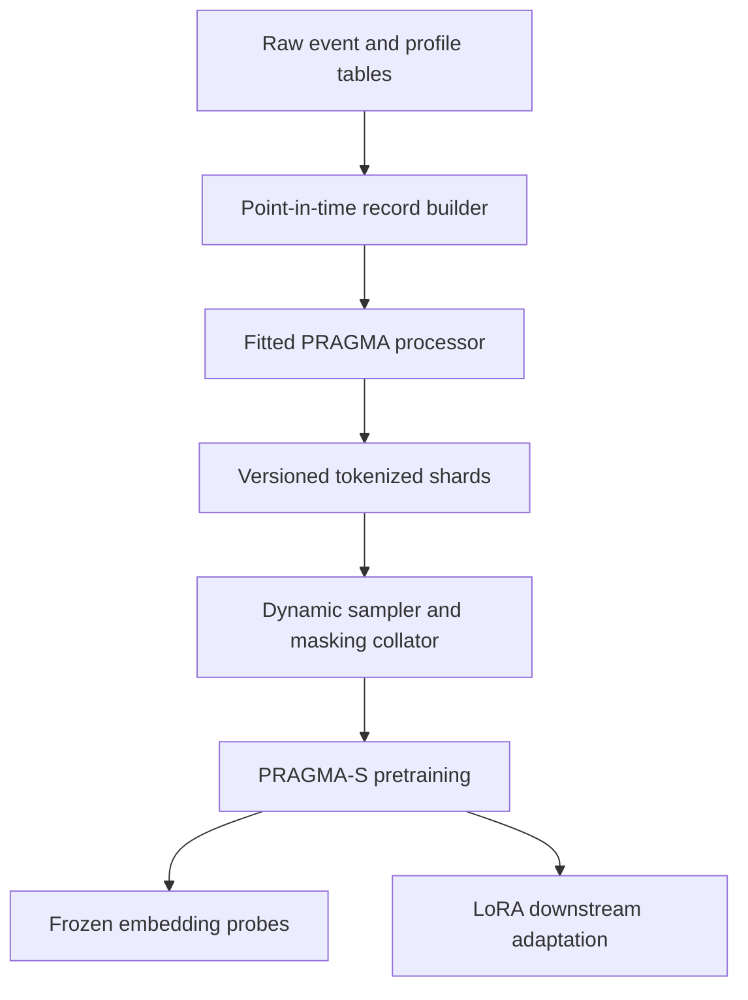

# PRAGMA Financial Foundation Model - Durable MVP Implementation Plan

**Status:** Proposed implementation baseline  
**Target:** A complete, production-shaped PRAGMA-S prototype that can be scaled and optimized without replacing its core data, model, or training interfaces  
**Primary reference:** Ostroukhov et al., *PRAGMA: Revolut Foundation Model* (2026)

## 1. Purpose

This document defines the implementation plan for a PRAGMA-inspired financial foundation model over heterogeneous, time-ordered banking events.

The MVP will be complete enough to:

- Fit and version the structured input processor from raw client data.
- Pretrain a PRAGMA-S encoder from random initialization using the paper's masked-modelling objective.
- Process long, variable-length customer histories efficiently.
- Train reproducibly on one or multiple GPUs.
- Resume interrupted runs without changing results materially.
- Extract reusable customer/history embeddings.
- Evaluate those embeddings through linear probes and conventional baselines.
- Adapt the pretrained backbone to at least one supervised task using LoRA.
- Scale later to larger datasets and model sizes without redesigning the system.

This is an architecture and training-recipe reproduction, not an attempt to reproduce Revolut's reported metrics. Their data, absolute metrics, code, and several important hyperparameters are unavailable.

## 2. MVP definition

### 2.1 Required MVP capabilities

The MVP is considered complete only when all of the following work end to end:

1. Raw event and profile-state records are converted into point-in-time-correct evaluation records.
2. A fitted processor converts each evaluation record into typed token IDs and temporal features.
3. The PRAGMA-S backbone contains the Profile State Encoder, Event Encoder, and History Encoder described in the paper.
4. Continuous-time RoPE, calendar features, within-field positions, special tokens, and the shared key/value embedding mechanism are implemented.
5. Individual-token, whole-event, and semantic-key masking are implemented correctly.
6. Events and histories can be represented as packed variable-length sequences without cross-record attention leakage.
7. Dynamic token-budget batching is supported.
8. Multi-GPU bf16 pretraining runs through Hugging Face Accelerate.
9. Checkpoints include the model, optimizer, scheduler, random states, configuration, processor, and data manifest.
10. Frozen embeddings can be extracted and evaluated with linear probes.
11. One downstream classification task can be trained with LoRA.
12. The optimized attention path is numerically checked against a padded reference implementation.

### 2.2 Explicit non-goals for the MVP

- PRAGMA-M (100M) or PRAGMA-L (1B) training.
- Reproducing the paper's 207B-token corpus.
- Cross-customer graph modelling or AML network detection.
- The optional frozen external text encoder described in the paper.
- Federated training or automatic pooling of data from multiple clients.
- Full production online serving, real-time feature retrieval, or automated retraining.
- Exact reproduction of Revolut's unpublished hyperparameters or absolute downstream results.

These exclusions limit scale and productization, not architectural completeness.

## 3. Executive technical decisions

| Area | Decision | Rationale and tradeoff |
|---|---|---|
| Core model | Implement directly in PyTorch | PRAGMA is a new hierarchical Transformer, not a standard BERT variant. PyTorch provides the control needed for packed attention, continuous-time RoPE, custom masking, and the three-level MLM head. |
| Hugging Face integration | Subclass `PreTrainedConfig` and `PreTrainedModel` | Retains standard configuration, initialization, `save_pretrained`, `from_pretrained`, weight tying, and future Hub compatibility without constraining the architecture. |
| Training orchestration | Use Hugging Face Accelerate with an explicit PyTorch loop | Accelerate supplies distributed execution, bf16, gradient accumulation, clipping, and state handling while preserving control over custom batches and losses. |
| Hugging Face Trainer | Do not use as the primary training engine | Trainer can technically train a custom module, but PRAGMA requires a custom token-budget sampler, packed batches, custom masked-position logits, and a hybrid optimizer. Overriding Trainer's dataloader, loss, optimizer, and checkpoint behavior would create more hidden coupling than value. |
| `AutoModelForMaskedLM` | Do not depend on it during development | An AutoClass selects an already implemented architecture; it does not create PRAGMA. Register AutoClasses only after the custom implementation and artifact format are stable. |
| Processor | Build a fitted `PragmaProcessor`; use Hugging Face Tokenizers only for the BPE subcomponent | Most inputs are keys, categories, numerical buckets, and time values rather than text. A normal NLP tokenizer is insufficient. |
| Attention | Define an attention-backend interface with both padded-reference and packed-varlen implementations | The padded backend is a permanent correctness oracle. The packed backend is required for the MVP's realistic variable-length histories. This avoids coupling the model to one kernel vendor. |
| Sequence representation | Use packed representations and cumulative sequence offsets as the canonical batch contract | Prevents a future data/model rewrite when histories become longer. Padded tensors remain available only for testing and very small debug runs. |
| Batching | Dynamic batches constrained by token and event budgets | A fixed number of customers per batch is unstable because history lengths differ by orders of magnitude. |
| Distributed strategy | Accelerate + DDP for PRAGMA-S | A 10M-parameter model does not require model sharding. FSDP or DeepSpeed should be introduced only when scaling the model or optimizer state justifies their complexity. |
| Precision | bf16 when supported; fp32 reference tests | Matches the paper and is more stable than fp16. Critical numerical tests remain in fp32. |
| Optimizer | Support AdamW and hybrid Muon+AdamW through one optimizer factory | AdamW is the stable initial baseline. The paper used Muon combined with AdamW but did not publish the parameter routing or hyperparameters; the hybrid option should be added and benchmarked without changing the training engine. |
| Downstream adaptation | Frozen embedding probes first, then LoRA via PEFT | Probes cheaply verify that pretraining learned transferable features. PEFT can inject LoRA into custom PyTorch models when the target linear modules are named consistently. |
| Experiment tracking | MLflow with immutable run manifests | Records configurations, metrics, processor version, data version, code revision, and checkpoint lineage. |

## 4. Target system flow



The point-in-time record, processor artifacts, and tokenized-record format are stable contracts. Later performance work may replace storage or attention backends, but it must not change these semantic contracts.

## 5. Data contract

### 5.1 Raw event

Each event belongs to one entity and contains:

- Stable entity identifier.
- Stable event identifier.
- Event timestamp.
- Event source or family.
- A variable set of key/value fields.
- Optional ingestion metadata used for auditing, but not automatically exposed to the model.

Example:

| entity_id | event_id | created_at | type | direction | amount | currency | description | mcc | view |
|---|---|---|---|---|---:|---|---|---|---|
| `u001` | `e001` | `2026-01-03 10:00` | `topup` | `in` | 100.00 | `GBP` | null | null | null |
| `u001` | `e002` | `2026-01-03 10:12` | `card_payment` | `out` | 14.99 | `GBP` | `metal plan` | `6012` | null |
| `u001` | `e003` | `2026-01-04 09:20` | `app_event` | null | null | null | null | null | `p2p_amount` |
| `u002` | `e004` | `2026-01-04 12:40` | `p2p_transfer` | `out` | 150.00 | `EUR` | null | null | null |

Different event families may expose different fields. Sparse/null columns are expected in a wide representation. The canonical in-memory representation is a timestamp plus a collection of typed key/value pairs.

### 5.2 Profile state

Profile state is a point-in-time snapshot associated with the record's evaluation point. It contains:

- Static or slowly changing attributes known at the evaluation time.
- Current contextual state, such as plan or balance quantile.
- Lifelong milestones, such as first top-up, with their original timestamps.
- No attribute calculated using information after the evaluation point.

### 5.3 Evaluation record

One pretraining observation is an `EvaluationRecord`:

```python
EvaluationRecord(
    entity_id="u001",
    evaluation_time="2026-06-30T23:59:59Z",
    profile_state={...},
    lifelong_events=[...],
    events_before_evaluation=[...],
)
```

An evaluation record is not necessarily a unique customer. A customer may contribute multiple records at different evaluation points, provided the sampling and dataset splits prevent leakage.

PRAGMA's architecture is built to generalize to entirely new customers absent
from the training data: "record-level embedding" does not mean a learned
embedding tied to a particular customer ID (there is no customer-ID lookup
table anywhere in the model). A record's embedding is instead computed from
its `profile_state` and `events_before_evaluation` — one customer's event
history and profile state, collected up to a specific evaluation/prediction
point — so it can be produced for a customer the model has never seen.

### 5.4 Point-in-time rules

- Include only events with `event_time <= evaluation_time`.
- Reconstruct profile state as it existed at `evaluation_time`.
- Define deterministic handling for equal timestamps using stable event IDs and, if required, source priority.
- Keep outcome windows separate from input windows for downstream labels.
- Fit vocabularies, numeric buckets, and BPE only on the pretraining training partition.
- Prevent repeated snapshots from the same entity from leaking near-identical histories across train and evaluation partitions.
- Version the cutoff logic as part of the data manifest.

### 5.5 Canonical schema strategy

Create a schema registry that defines for every semantic key:

- Canonical key name and ID.
- Source mappings and aliases.
- Value type: numerical, categorical, text, or ignored.
- Null/missing policy.
- Numerical transformation and bucket metadata.
- Categorical normalization and unknown-value behavior.
- Text normalization and privacy rules.
- Whether the key is eligible for MLM masking.
- Whether the key is allowed in regulated downstream decisions.

For multiple clients, raw fields must first map to the canonical schema. Client identity should not be a model feature by default. Pooling data across clients is a separate legal, governance, and modelling decision rather than an automatic consequence of using a common processor.

## 6. Structured processor and vocabulary

### 6.1 Required fitted artifacts

| Input type | Fitted artifact | Model representation |
|---|---|---|
| Semantic keys | Key vocabulary | One token per key; approximately 60 in the paper |
| Numerical values | Per-key percentile boundaries plus a dedicated zero bucket | Global percentile-value tokens combined with the key embedding |
| Categorical values | Normalized categorical vocabulary with manual overrides | One value token |
| Text values | Shared BPE vocabulary trained only on approved text fields | One or more subword value tokens |
| Time gaps | Fixed soft-log transform | Continuous coordinate for RoPE |
| Calendar time | Fixed hour/day cyclical conversion | Two-layer MLP output added to event summaries |
| Special values | Stable special-token registry | `[PAD]`, `[UNK]`, `[MASK]`, `[USR]`, `[EVT]` and any reserved values |

The paper reports approximately 28,000 value tokens, but the MVP vocabulary size should be learned from the available corpus and constrained by configuration.

### 6.2 Numerical representation

For each numerical semantic key:

1. Fit percentile boundaries using only the training partition.
2. Reserve a separate zero bucket.
3. Store boundaries, training counts, null rate, and clipping behavior.
4. Map inference-time outliers to the edge buckets rather than refitting.

Numerical reconstruction predicts the bucket, not the original exact amount. Raw values remain available for auditing and conventional baselines but are not sent directly to the default PRAGMA backbone.

### 6.3 Categorical versus textual values

- Use a configurable cardinality threshold as an initial rule.
- Maintain explicit per-key overrides for values that must stay atomic, such as merchant-category codes.
- Train one shared BPE tokenizer across the approved textual fields.
- Remove or pseudonymize personally identifiable information before BPE training.
- Track per-key unknown-token and out-of-vocabulary rates.

### 6.4 Token representation

For every value token, the key ID is replicated. A multi-token text value therefore repeats the same semantic key:

| Raw field | Key IDs | Value IDs | Within-field positions |
|---|---|---|---|
| `type=card_payment` | `[K_TYPE]` | `[V_CARD_PAYMENT]` | `[0]` |
| `amount=14.99` | `[K_AMOUNT]` | `[V_PERCENTILE_24]` | `[0]` |
| `description=metal plan` | `[K_DESCRIPTION, K_DESCRIPTION, K_DESCRIPTION]` | `[V_MET, V_AL, V_PLAN]` | `[0, 1, 2]` |

The embedding input is:

\[
x_i = E(k_i) + E(v_i) + P_{within-field}(i)
\]

Keys and values occupy stable ID ranges in one shared embedding table. Within-field positions use a deterministic sinusoidal encoding.

### 6.5 Processor artifact bundle

The processor must save and reload as one versioned bundle containing:

- Schema version.
- Key vocabulary.
- Value vocabulary and ID ranges.
- Special-token IDs.
- Per-key numeric bucket boundaries.
- Categorical mappings and manual overrides.
- BPE model, vocabulary, normalization, and merge rules.
- Time-transform configuration.
- Maximum lengths and truncation policy.
- Training data fingerprint and fit timestamp.
- Library and package versions needed to reproduce tokenization.

A model checkpoint is invalid without the exact processor bundle used to create its token IDs.

## 7. Model architecture

### 7.1 PRAGMA-S configuration

The first complete model targets the paper's small configuration:

| Property | PRAGMA-S value |
|---|---:|
| Approximate parameters | 10M |
| Model width | 192 |
| Feed-forward width | 768 |
| Profile State Encoder layers | 1 |
| Event Encoder layers | 5 |
| History Encoder layers | 2 |
| Attention heads | 3 |
| Activation | GELU |
| Normalization | Pre-norm |
| Dropout | 0.1 |
| Maximum event tokens | 24 |
| Maximum profile-state tokens | 200 |
| Maximum history events supported | 6,500 |

The history cap must be configurable so early runs may use a lower value without changing the data or model interfaces.

### 7.2 Shared embeddings

`SharedKeyValueEmbedding` will:

- Store one learnable embedding table for keys, values, and special tokens.
- Sum key and value embeddings.
- Add within-field positional encodings.
- Prepend `[USR]` to profile state and `[EVT]` to each event.
- Expose the value-vocabulary slice for tied MLM output projection.

### 7.3 Temporal encoding

Implement the paper's soft-log time transform:

\[
f(t) = 8 \ln(1 + t/8)
\]

Time is represented in three distinct ways:

1. **Within-field position:** position of a BPE token inside one field value.
2. **Profile temporal coordinate:** elapsed time from lifelong milestones to the evaluation point; static profile attributes receive zero.
3. **History temporal coordinate:** elapsed time from each event to the latest event in the history.

`ContinuousRoPE` must accept floating-point temporal coordinates rather than assuming ordinary integer token positions.

For each event, hour of day, day of week, and day of month are converted to fixed sine/cosine cyclical features. `CalendarEncoder` maps those features through two MLP layers to the model width and adds the result to the event's `[EVT]` embedding.

### 7.4 Encoder flow

1. **Profile State Encoder**
   - Encodes profile key/value tokens bidirectionally.
   - Applies continuous-time RoPE to lifelong-event coordinates.
   - Emits token-level states and one `[USR]` summary.

2. **Event Encoder**
   - Encodes every event independently of all other events.
   - Receives packed event-token sequences with boundaries that prohibit cross-event attention.
   - Emits token-level states for MLM and one `[EVT]` summary per event.
   - Adds the calendar embedding to each event summary.

3. **History Encoder**
   - Receives `[USR]` followed by the ordered event summaries.
   - Applies continuous-time RoPE using event time-to-latest-event coordinates.
   - Contextualizes information across the complete customer history.
   - Emits contextual `[USR]` and `[EVT]` representations.

### 7.5 MLM head

For every masked value-token position, `PragmaMLMHead` concatenates:

- The Event Encoder state at that token position.
- The History Encoder state of the corresponding event's `[EVT]` token.
- The History Encoder state of the record's `[USR]` token.

The resulting `3 x model_width` vector is projected back to `model_width` and matched against the tied value-embedding matrix to produce logits.

The loss is cross-entropy with configurable label smoothing and is computed only for objective positions. Logits should be materialized only for masked positions to avoid allocating a full `batch x sequence x vocabulary` tensor.

The paper describes masking event-history tokens, not profile-state tokens. The MVP will therefore leave profile-state values visible and use them as contextual signals during pretraining.

## 8. Masking design

### 8.1 Mask sources

Implement the three sources described in the paper:

| Source | Paper probability | MVP interpretation |
|---|---:|---|
| Individual value token | 15% | Sample eligible event value-token positions independently |
| Whole event | 10% | Sample events and mask every eligible value token in each selected event |
| Semantic key | 10% | Sample semantic keys within a record and mask all their eligible values across the record's event history |

The three masks are sampled separately and combined by union. The collator records the origin of each selected position so losses and accuracy can be analyzed by masking strategy. This interpretation is an explicit MVP decision because the paper does not define overlap handling.

### 8.2 Corruption and labels

The collator must never repeat the bug where a target token remains visible to the model.

For objective positions:

- Save the original value ID in `mlm_labels`.
- Replace the input value with `[MASK]`.
- Set every non-objective label to `-100`.

For a small configurable fraction of selected positions:

- Replace the input with `[UNK]` rather than `[MASK]`.
- Set the label to `-100`, following the paper's input-dropout description.

Special tokens, padding, and non-maskable fields are never selected. The first engineering default for the unspecified `[UNK]` fraction should be 5%, followed by a small ablation over 0%, 5%, and 10%.

## 9. Variable-length representation and batching

### 9.1 Canonical packed batch

`PragmaBatch` will contain flat token/event buffers plus cumulative boundaries:

- Packed profile key/value tokens.
- Packed event key/value tokens.
- Within-field positions.
- Event-token cumulative offsets.
- Event-to-record mapping.
- Packed history summaries or history cumulative offsets.
- Profile and history temporal coordinates.
- Event calendar features.
- Masked-token positions and labels.
- Counts and masks needed for validation and metrics.

Boundaries are semantic safety controls: event tokens must never attend to another event inside the Event Encoder, and one customer's history must never attend to another customer's history.

### 9.2 Attention backends

Define one interface with two implementations:

1. `PaddedAttentionBackend`
   - Uses standard scaled dot-product attention and explicit masks.
   - Supports small fp32 tests and toy training.
   - Remains permanently as a reference implementation.

2. `VarLenAttentionBackend`
   - Uses a supported packed variable-length attention kernel.
   - Accepts flat buffers and cumulative sequence lengths.
   - Is used for actual MVP pretraining.
   - Is isolated behind the interface so PyTorch varlen attention, FlashAttention, or another kernel can be changed without modifying encoder logic.

Before enabling the optimized backend for training, forward outputs and backward gradients must match the padded backend within defined numerical tolerances on randomized small batches.

### 9.3 Dynamic batch sampler

`TokenBudgetBatchSampler` will:

- Group records into coarse history-length buckets.
- Greedily add records until an event-token, history-event, or memory proxy budget is reached.
- Shuffle buckets and records reproducibly each epoch.
- Produce balanced work across distributed ranks.
- Report actual tokens, events, records, padding avoided, and batch-size distribution.

The initial storage implementation may bucket by event-count ranges rather than creating one shard per exact event count. The model contract remains compatible with the paper's exact-count sharding and with fully packed histories.

## 10. Storage and data loading

### 10.1 Durable storage layout

- Raw curated events: partitioned Parquet.
- Tokenized event-history shards: Parquet or Arrow with nested list columns and length statistics.
- Profile-state lookup: LMDB-backed store when repeated profile retrieval or deduplication justifies it.
- Dataset manifest: JSON containing schema version, processor version, partitions, row counts, token counts, time ranges, checksums, and source lineage.
- Shard index: maps shards to record count, event count, token count, and length bucket.

Use storage interfaces so a simple local Parquet backend and a distributed object-store backend expose the same record semantics.

### 10.2 Data-loading requirements

- Stream shards rather than materializing the full corpus in memory.
- Tokenize offline for serious runs; online tokenization is allowed only for debug data.
- Validate shard checksums and processor compatibility before training.
- Seed worker and distributed sampling deterministically.
- Prefetch without allowing unbounded host-memory use.
- Track corrupted records, truncation rates, OOV rates, and dropped zero-event users.

## 11. Components and classes

### 11.1 Configuration and artifacts

| Class/component | Responsibility |
|---|---|
| `PragmaConfig` | Model dimensions, layer counts, heads, dropout, vocabulary ranges, maximum lengths, attention backend, and artifact compatibility. Subclass `PreTrainedConfig`. |
| `ProcessorConfig` | Field types, vocabulary rules, numeric buckets, BPE settings, normalization, and truncation. |
| `MaskingConfig` | Mask probabilities, eligibility, `[UNK]` input-dropout fraction, overlap behavior, and label-smoothing value. |
| `TrainingConfig` | Optimizer, scheduler, precision, gradient accumulation, clipping, batch budgets, logging, evaluation, and checkpoint intervals. |
| `ArtifactManifest` | Code revision, dependency versions, dataset fingerprint, processor ID, configuration hashes, checkpoint lineage, and validation status. |
| `CheckpointManager` | Atomic save/resume of model, optimizer, scheduler, scaler, RNG, sampler, global tokens, global steps, and manifests. |

### 11.2 Schema, records, and processing

| Class/component | Responsibility |
|---|---|
| `EventRecord` | Validated raw event with entity, event ID, timestamp, source, and typed fields. |
| `ProfileState` | Point-in-time profile attributes and lifelong milestones. |
| `EvaluationRecord` | Profile state plus all eligible events up to one evaluation point. |
| `SchemaRegistry` | Canonical keys, client/source mappings, field types, policies, and schema versioning. |
| `PointInTimeRecordBuilder` | Builds leakage-safe evaluation records and applies deterministic ordering and cutoff rules. |
| `KeyVocabulary` | Stable semantic-key IDs. |
| `NumericBucketizer` | Fits, saves, loads, and applies per-key percentile bins and zero buckets. |
| `CategoricalEncoder` | Normalizes atomic values and handles unknown categories. |
| `TextBPEEncoder` | Trains and applies the shared BPE model to approved text fields. |
| `TemporalFeatureEncoder` | Computes soft-log time gaps and calendar-cycle features. |
| `PragmaProcessor` | Coordinates all fitted encoders and converts evaluation records into `TokenizedRecord` objects. |
| `TokenizedRecord` | Stable serialized representation of one processed evaluation record. |
| `PragmaRecordStore` | Abstract storage interface for tokenized records and manifests. |
| `ParquetShardStore` | Streaming Parquet/Arrow implementation with length metadata. |
| `LMDBProfileStore` | Optional deduplicated profile-state lookup compatible with the paper's layout. |
| `TokenBudgetBatchSampler` | Forms reproducible batches under token/event budgets and distributed constraints. |
| `PragmaCollator` | Packs records, invokes masking, builds offsets/mappings, and returns `PragmaBatch`. |
| `PragmaBatch` | Typed batch object containing all flat buffers, offsets, features, labels, and mappings. |
| `MaskingPlanner` | Samples token, event, and key masks without mutating source records and returns auditable mask metadata. |

### 11.3 Model

| Class/component | Responsibility |
|---|---|
| `SharedKeyValueEmbedding` | Shared key/value lookup, special tokens, key/value summation, and tied MLM output weights. |
| `WithinFieldPositionEncoding` | Deterministic sinusoidal positions for multi-token values. |
| `ContinuousRoPE` | Rotary encoding for arbitrary floating-point time coordinates. |
| `CalendarEncoder` | Two-layer MLP over sine/cosine hour, weekday, and day-of-month features. |
| `AttentionBackend` | Interface for attention over bounded independent sequences. |
| `PaddedAttentionBackend` | Reference attention using padded tensors and explicit masks. |
| `VarLenAttentionBackend` | Packed variable-length attention using flat buffers and cumulative offsets. |
| `PragmaTransformerBlock` | Pre-norm self-attention, GELU feed-forward network, residual connections, and dropout. |
| `ProfileStateEncoder` | Encodes profile values and returns the `[USR]` summary. |
| `EventEncoder` | Independently encodes packed events and returns token states plus `[EVT]` summaries. |
| `HistoryEncoder` | Encodes `[USR]` and ordered event summaries across the customer history. |
| `PragmaModel` | Full reusable backbone. Subclass `PreTrainedModel`. |
| `PragmaMLMHead` | Combines local token, contextual event, and user states and produces tied value logits. |
| `PragmaForMaskedModeling` | Randomly initialized pretraining model that returns masked logits, loss, and structured diagnostics. |
| `PragmaForTask` | Backbone plus configurable binary, multiclass, multilabel, or regression head. |
| `PragmaOutput` | Typed `ModelOutput` carrying loss, record embeddings, event embeddings, masked logits, and optional diagnostics. |

### 11.4 Training and evaluation

| Class/component | Responsibility |
|---|---|
| `OptimizerFactory` | Creates AdamW or hybrid Muon+AdamW with explicit parameter routing. |
| `SchedulerFactory` | Creates warmup and decay schedule from optimizer-update count or token count. |
| `PretrainingEngine` | Explicit Accelerate-based train/evaluate loop, accumulation, clipping, logging, checkpointing, and resume. |
| `PretrainingMetrics` | Global and per-source/key/type loss, top-k accuracy, mask coverage, OOV, throughput, and memory metrics. |
| `EmbeddingExtractor` | Runs the frozen backbone and writes `[USR]`, last `[EVT]`, and concatenated embeddings with identifiers. |
| `LinearProbeRunner` | Standard-scales embeddings and fits logistic/linear probes using fixed data splits. |
| `BaselineRunner` | Evaluates agreed conventional baselines using the same labels and splits. |
| `LoRAAdapterFactory` | Uses PEFT to inject LoRA into named QKV and MLP projections. |
| `DownstreamTrainer` | Trains task heads and LoRA adapters with supervised labels and task-specific metrics. |
| `ModelEvaluator` | Produces comparable offline reports across checkpoints, probes, LoRA runs, and baselines. |

## 12. Repository structure

```text
src/pragma/
  config/
  schema/
  data/
  processing/
  attention/
  modeling/
  masking/
  training/
  evaluation/
  downstream/
  artifacts/
tests/
  unit/
  integration/
  parity/
  distributed/
configs/
  model/
  processor/
  pretraining/
  downstream/
scripts/
  build_records.py
  fit_processor.py
  tokenize_shards.py
  pretrain.py
  extract_embeddings.py
  run_probe.py
  finetune_lora.py
```

Scripts should be thin entry points. Business rules and training logic belong in testable modules under `src/pragma`.

## 13. Training system

### 13.1 Why Accelerate instead of Trainer

Accelerate should manage:

- Device placement.
- DDP process setup.
- bf16 autocast.
- Gradient accumulation and synchronization.
- Gradient clipping.
- Main-process-only logging and artifact writes.
- Distributed checkpoint state.

The project keeps ownership of:

- Shard streaming.
- Token-budget batch formation.
- Packed offsets and mappings.
- Structured corruption and mask diagnostics.
- Masked-position-only logits.
- Hybrid optimizer parameter routing.
- Token-based scheduling and throughput metrics.

Trainer remains useful for ordinary rectangular NLP tasks, but relying on it here would either constrain the architecture or require overriding most of the behavior the team needs to understand and test.

### 13.2 Initial optimization policy

Start correctness and small data runs with AdamW. Before the first meaningful PRAGMA-S corpus run, add the hybrid Muon+AdamW option and perform a controlled comparison.

Initial search space, explicitly not claimed to come from the paper:

| Hyperparameter | Initial candidates |
|---|---|
| Peak learning rate | `1e-4`, `3e-4`, `6e-4` |
| Warmup | 1% or 3% of optimizer updates |
| Weight decay | `0.01`, `0.1` |
| Gradient clipping | `1.0` |
| Label smoothing | `0.0`, `0.1` |
| `[UNK]` input dropout | 0%, 5%, 10% |
| Scheduler | Cosine decay; constant-with-warmup as control |

Tune with a fixed token budget and validation corpus. Do not compare runs using only epochs because dynamic batches contain different numbers of records.

### 13.3 Training progress units

Track all of the following:

- Optimizer updates.
- Records processed.
- Events processed.
- Value tokens processed.
- Objective tokens predicted.
- Wall-clock time.
- GPU-hours.

Tokens processed should be the primary scale coordinate. Epochs are secondary because the corpus and sampling strategy may change.

### 13.4 Checkpoint requirements

Every resumable checkpoint contains:

- Model weights in a standard safe format.
- Processor identity and compatibility hash.
- Model and masking configurations.
- Optimizer and scheduler state.
- Accelerate/distributed state.
- Python, NumPy, CPU, and GPU RNG states.
- Sampler epoch/position or equivalent deterministic resume state.
- Global token, event, record, and update counters.
- Data manifest and shard list.
- Code revision and dependency lock fingerprint.
- Validation metrics and best-checkpoint status.

## 14. Pretraining evaluation

### 14.1 MLM diagnostics

Track:

- Validation cross-entropy overall.
- Cross-entropy by event source, semantic key, and value type.
- Top-1 and top-k masked-token accuracy.
- Mask coverage by masking source.
- Collision rate between token/event/key masks.
- `[UNK]` input-dropout rate.
- OOV and unknown-category rates.
- Truncation rates.
- Tokens per second and GPU memory.

Perplexity may be recorded but should not be a headline metric. A heterogeneous vocabulary mixes easy frequent categories, numerical buckets, and BPE tokens, so one perplexity number is difficult to interpret.

### 14.2 Transfer evaluation

For selected checkpoints:

1. Freeze the backbone.
2. Extract `[USR]`, final contextual `[EVT]`, and their concatenation.
3. Standard-scale embeddings using only the downstream training partition.
4. Fit logistic or linear probes using fixed splits.
5. Compare with agreed task-specific baselines.
6. Select checkpoints using downstream validation metrics as well as MLM loss.

MLM loss alone is not sufficient evidence that the model learned commercially useful representations.

### 14.3 Baselines

At least the following should use the same point-in-time inputs, labels, and temporal splits:

- Aggregated features plus LightGBM or another strong GBDT.
- Logistic regression on conventional aggregated features.
- A small task-specific sequence model when justified.
- Frozen PRAGMA embeddings plus a linear model.
- PRAGMA with LoRA.

The project is successful only if the shared representation provides value relative to the cost and maintenance of these baselines.

## 15. LoRA downstream adaptation

### 15.1 Entry condition

Begin LoRA only after:

- The pretrained checkpoint passes all architecture and masking tests.
- Frozen embeddings beat or materially complement at least one simple baseline.
- A point-in-time-correct labelled downstream dataset is frozen.

### 15.2 Implementation

- Use Hugging Face PEFT rather than implementing LoRA mathematics manually.
- Keep stable, explicit names for Q, K, V, output, and MLP linear projections.
- Apply LoRA to QKV and MLP projections, matching the paper's stated target families.
- Start with rank 8 and alpha 8.
- Sweep ranks 4, 8, and 16 on smaller downstream datasets.
- Save adapters and task heads separately from the immutable base checkpoint.
- Log the exact base-checkpoint hash and processor version with each adapter.

The first MVP task should be a well-defined binary classification problem with sufficient positive examples and a clear prediction horizon. AML is not an appropriate first task because the paper's record-isolated architecture does not model cross-customer networks.

## 16. Testing and quality gates

### 16.1 Data and leakage tests

- No input event occurs after its evaluation point.
- Profile attributes are reconstructed as of the evaluation point.
- Outcome-window data is absent from model inputs.
- Train-only data fits the processor.
- Repeated customer histories obey the split policy.
- Ordering is deterministic when timestamps are equal.
- Client/source mappings resolve to the intended canonical keys.

### 16.2 Processor tests

- Save/load round trip produces identical token IDs.
- Numeric edge cases map to documented buckets.
- Zero has its dedicated bucket.
- Unknown categories and BPE fragments map correctly.
- Multi-token fields repeat key IDs and increment only within-field positions.
- Truncation preserves required special tokens and recent-history policy.

### 16.3 Masking tests

- Every objective token is corrupted in the input.
- Every non-objective token has label `-100`.
- `[UNK]` input-dropout positions have label `-100`.
- Special and padding tokens are never targets.
- Whole-event masking covers the complete selected event.
- Key masking covers every occurrence defined by the masking policy.
- Masking is deterministic under a fixed seed and changes across epochs when expected.

### 16.4 Architecture tests

- Event Encoder outputs are invariant to unrelated events in the same packed batch.
- History Encoder outputs are invariant to unrelated customer records in the same packed batch.
- Profile and event `[USR]`/`[EVT]` positions are correctly mapped.
- Masked-token logits receive the correct local event, contextual event, and contextual user states.
- Time coordinates change outputs and zero-time behavior is stable.
- Calendar features have the expected periodicity.
- Padded and varlen attention outputs match within tolerance.
- Padded and varlen gradients match within tolerance.
- All intended parameters receive finite gradients.

### 16.5 Training tests

- The model can deliberately overfit a tiny synthetic corpus.
- Single-GPU and multi-GPU runs produce comparable learning curves.
- Gradient accumulation matches an equivalent larger batch within tolerance.
- Interrupted training resumes without resetting the scheduler, counters, or sampler.
- No NaN/Inf values occur in normal bf16 training.
- Throughput and peak memory regressions are automatically reported.

## 17. Recommended development order

Each phase has an exit gate. Do not scale data or GPUs before the current gate passes.

### Phase 0 - Freeze contracts and decisions

**Build**

- Architecture decision records for data schema, evaluation points, processor, packed batches, masking semantics, attention backends, and checkpoint format.
- Repository structure, dependency lock, linting, typing, unit-test framework, and CI.

**Exit gate**

- Team agrees on the canonical record and batch contracts.
- Every paper ambiguity that affects implementation is either decided or represented as configuration.

### Phase 1 - Create synthetic and curated sample data

**Build**

- Synthetic histories covering all value types and edge cases.
- A small de-identified client extract with known evaluation points.
- Schema registry and raw validation reports.

**Exit gate**

- Records can be reconstructed deterministically.
- Leakage and schema tests pass.
- Field types and privacy treatment have owners and approval.

### Phase 2 - Implement the fitted processor

**Build**

- Key vocabulary, numeric bucketizer, categorical encoder, BPE encoder, temporal features, special tokens, and processor serialization.
- Offline tokenized-record writer and data manifest.

**Exit gate**

- Save/load produces identical tokens.
- Token distributions, OOV, truncation, and per-key coverage are reviewed.
- No validation/test data was used to fit processor artifacts.

### Phase 3 - Implement record storage and reference batching

**Build**

- Tokenized Parquet/Arrow shards.
- Reference dataset, padded collator, and small fixed batches.
- `PragmaBatch` contract and mapping validation.

**Exit gate**

- Batches reconstruct their source records exactly.
- Cross-event and cross-record boundaries are validated.

### Phase 4 - Implement structured masking

**Build**

- `MaskingPlanner` and collator integration for token, event, and key masks.
- Mask-origin diagnostics and deterministic seeding.

**Exit gate**

- All masking tests pass.
- Visual inspection of sampled masked records confirms that targets are not visible.

### Phase 5 - Implement the padded reference model

**Build**

- Shared embeddings, within-field positions, continuous RoPE, calendar encoder, all three encoders, MLM head, and random initialization.
- `PragmaConfig`, `PragmaModel`, and `PragmaForMaskedModeling` as Hugging Face-compatible custom classes.

**Exit gate**

- Tensor-shape, isolation, mapping, temporal, and gradient tests pass in fp32.
- Parameter count is approximately 10M under the PRAGMA-S configuration.

### Phase 6 - Prove learnability on tiny data

**Build**

- Single-GPU PyTorch/Accelerate debug loop.
- Tiny synthetic pretraining task with known predictable relationships.

**Exit gate**

- The model overfits the tiny corpus.
- MLM loss decreases for all three masking strategies.
- Shuffled or destroyed context produces the expected degradation.

### Phase 7 - Implement packed varlen execution

**Build**

- Packed profile, event, and history representations.
- `VarLenAttentionBackend`.
- Event-to-history and token-to-event gather/broadcast operations.
- Backend parity and performance tests.

**Exit gate**

- Forward and backward parity with the padded backend passes.
- No attention crosses event or customer boundaries.
- Packed execution demonstrates a meaningful memory or throughput improvement on representative lengths.

### Phase 8 - Implement durable distributed pretraining

**Build**

- Dynamic token-budget sampler.
- Accelerate-based DDP/bf16 engine.
- Optimizer and scheduler factories.
- Atomic checkpoints, exact counters, resume, MLflow logging, and failure recovery.

**Exit gate**

- One- and multi-GPU runs are comparable.
- A stopped multi-GPU run resumes correctly.
- Throughput, memory, token counts, and masking metrics are trustworthy.

### Phase 9 - Run a PRAGMA-S pilot corpus

**Build**

- Fixed training and validation corpora large enough to test representation learning rather than only pipeline correctness.
- AdamW learning-rate pilot, followed by hybrid Muon+AdamW comparison.
- Periodic frozen-embedding extraction.

**Exit gate**

- Stable validation learning curves.
- No material data-quality, OOV, truncation, or instability blocker.
- At least one checkpoint produces useful downstream probe signal.

### Phase 10 - Build embedding probes and baselines

**Build**

- Standardized `[USR]`, last `[EVT]`, and concatenated embeddings.
- Fixed linear-probe and baseline evaluation pipelines.
- Reproducible comparison report.

**Exit gate**

- The team can state where pretraining helps, where it does not, and whether the shared backbone justifies further investment.

### Phase 11 - Implement one LoRA task

**Build**

- `PragmaForTask`, PEFT adapter configuration, supervised trainer, task metrics, and separate adapter artifacts.
- Rank 8/alpha 8 baseline and limited rank sweep.

**Exit gate**

- LoRA is compared against the frozen probe and conventional baseline on the same split.
- The base checkpoint remains immutable and adapters reload independently.

### Phase 12 - Optimize and decide on scale-up

**Possible work**

- Kernel/backend tuning.
- Better length bucketing and prefetching.
- `torch.compile` evaluation.
- Gradient checkpointing.
- FSDP or DeepSpeed only if required.
- Larger corpus, PRAGMA-M feasibility study, or additional downstream tasks.

**Scale-up gate**

- Measured downstream value justifies additional compute.
- Scaling bottlenecks are identified with profiling rather than assumed.
- Data volume and diversity are sufficient for the larger model.

## 18. What the paper does not make clear

The following must be treated as project decisions or experimental variables:

### Data and tokenization

- How pretraining evaluation points were sampled.
- Whether one user contributes multiple records and how frequently.
- Exact train/validation split rules and user overlap.
- Exact numerical percentile bucket count and whether boundaries are per key.
- Categorical cardinality threshold and complete manual-override rules.
- BPE vocabulary allocation, normalization, pre-tokenizer, minimum frequency, and training corpus sampling.
- Complete key/value vocabulary and special-token definitions.
- Treatment of missing values and unseen semantic keys.
- Tie-breaking for events with identical timestamps.
- Whether categorical vocabulary items are global or namespaced beyond the separate key embedding.

### Masking and objective

- Whether the three masking probabilities are independent and how overlaps are resolved.
- Whether semantic-key masking is record-wide, event-local, or batch-wide.
- Exact fraction replaced by `[UNK]`.
- Whether any selected tokens remain unchanged or are replaced randomly.
- Whether only value IDs or the combined key/value token space is predicted.
- Whether any profile-state values are masked.
- Label-smoothing coefficient.

### Architecture

- Weight-initialization recipe.
- RoPE base/frequency details for continuous temporal coordinates.
- Calendar MLP hidden dimension, activation, normalization, and dropout.
- Exact sharing of embedding and output-projection weights.
- Attention-kernel implementation and numerical settings.
- Treatment of histories at or near the 6,500-event limit beyond keeping the most recent events.

### Pretraining

- Peak learning rates, warmup, decay schedule, weight decay, and gradient clipping.
- Exact parameter routing between Muon and AdamW.
- Muon and AdamW hyperparameters.
- Global token budget and per-GPU batch budgets.
- Gradient accumulation.
- Total optimizer updates, epochs, or exact number of tokens consumed.
- Checkpoint-selection and early-stopping criteria.
- Distributed strategy and communication settings.
- Validation-corpus size and evaluation frequency.

### LoRA and downstream evaluation

- Exact target-module names beyond QKV and MLP families.
- LoRA dropout, learning rate, batch size, weight decay, and training steps.
- Task-head architecture.
- Dataset sizes, class prevalence, and full split definitions.
- Absolute baseline and PRAGMA metrics.

All assumptions resolving these gaps must be recorded in decision documents and configuration files. They should not remain implicit in code.

## 19. Operational artifacts and reproducibility

Every promoted pretraining checkpoint should be accompanied by:

- Model weights and configuration.
- Processor bundle.
- Data and shard manifest.
- Training and masking configurations.
- Dependency lock and code revision.
- Training-curve and throughput report.
- Data-quality and truncation report.
- Padded-versus-varlen parity results.
- Frozen-probe evaluation report.
- Model card documenting intended and prohibited uses.
- Data card documenting sources, time ranges, privacy controls, and known biases.

## 20. Team workstreams and dependency order

| Workstream | Primary responsibility | Must coordinate with |
|---|---|---|
| Data and governance | Canonical schema, point-in-time records, privacy, lineage, client mappings | Processor and evaluation |
| Processor and storage | Vocabularies, buckets, BPE, tokenized shards, manifests | Data and model |
| Model architecture | Embeddings, RoPE, encoders, attention backends, MLM head | Processor and training |
| Training systems | Accelerate, batching, optimizer, checkpoints, performance | Model and infrastructure |
| Evaluation | Baselines, probes, LoRA, temporal splits, reports | Data and model |
| MLOps/platform | Environments, MLflow, artifact promotion, access controls, reproducibility | All workstreams |

Data contracts and masking correctness are on the critical path. Additional GPUs do not reduce those risks.

## 21. Final MVP acceptance criteria

The MVP is accepted when the team can demonstrate, from a clean checkout and a versioned dataset:

1. Reproducible processor fitting and tokenized-shard generation.
2. Correct PRAGMA-S initialization at approximately 10M parameters.
3. Successful padded-reference and packed-varlen parity tests.
4. Multi-GPU bf16 pretraining with dynamic token-budget batches.
5. Correct stop/resume behavior from a checkpoint.
6. Trustworthy MLM diagnostics with no visible-target masking bug.
7. Frozen embeddings and fixed linear-probe results.
8. Comparison with at least one strong conventional baseline.
9. One reloadable LoRA adapter trained on a valid downstream task.
10. Complete processor, model, data, code, and experiment lineage.

Passing these criteria produces a durable foundation for later optimization. Failure to beat every conventional baseline does not make the engineering MVP invalid, but it does affect the business decision to scale the model or corpus.

## 22. References

- Ostroukhov, M. et al. [PRAGMA: Revolut Foundation Model](https://arxiv.org/abs/2604.08649), 2026.
- Hugging Face. [Accelerate: Add Accelerate to your code](https://huggingface.co/docs/accelerate/en/basic_tutorials/migration).
- Hugging Face. [Transformers Trainer](https://huggingface.co/docs/transformers/main_classes/trainer).
- Hugging Face. [Custom models](https://huggingface.co/docs/transformers/custom_models).
- Hugging Face. [PreTrainedModel](https://huggingface.co/docs/transformers/main_classes/model).
- Hugging Face. [Tokenizers BPE quick tour](https://huggingface.co/docs/tokenizers/quicktour).
- Hugging Face. [PEFT custom models](https://huggingface.co/docs/peft/developer_guides/custom_models).
- Hugging Face. [PEFT LoRA](https://huggingface.co/docs/peft/package_reference/lora).
- PyTorch. [Using variable-length attention](https://docs.pytorch.org/tutorials/intermediate/variable_length_attention_tutorial.html).
- PyTorch. [DistributedDataParallel](https://docs.pytorch.org/docs/stable/generated/torch.nn.parallel.DistributedDataParallel.html).

